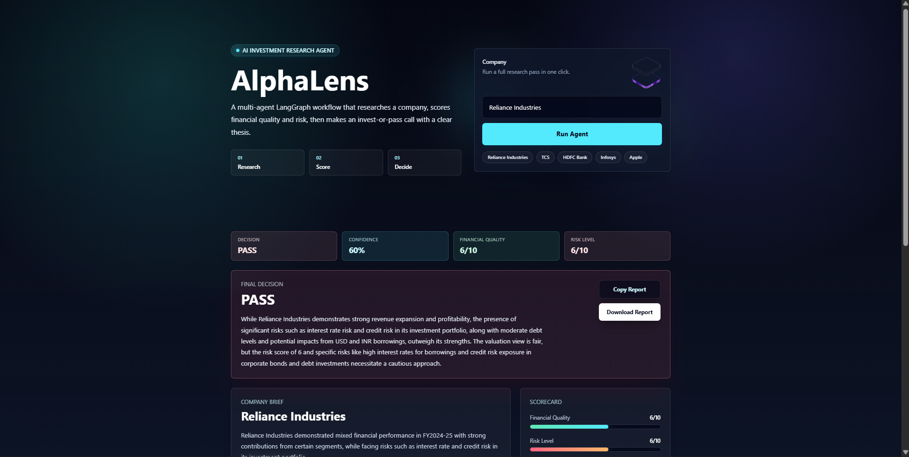
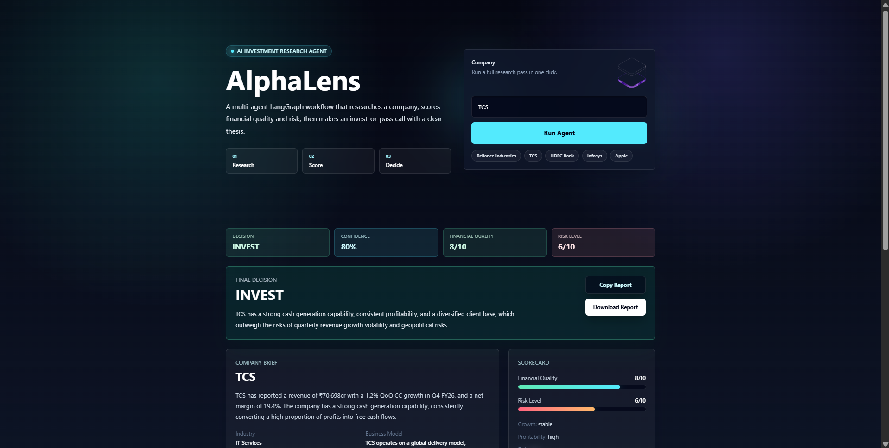
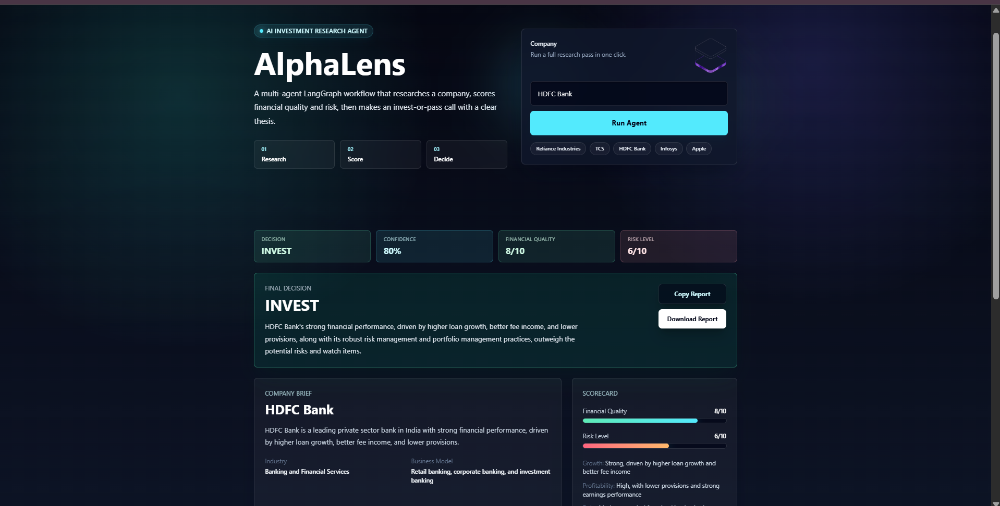
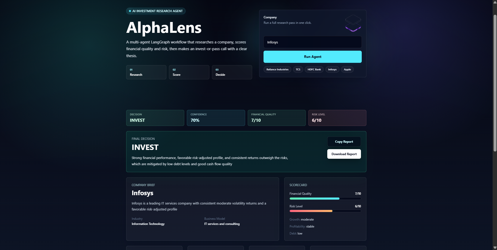

# AlphaLens

AlphaLens is an AI Investment Research Agent built for the InsideIIM x Altuni AI Labs assignment. The app takes a company name, researches the business, studies financial quality and risk, and gives a final `INVEST` or `PASS` decision with reasoning.

The goal of this project is not just to show a chatbot response. The goal is to show an end-to-end agent workflow where different agents handle different parts of an investment memo and combine their outputs into one final recommendation.

## Project links

[Open AlphaLens](https://ai-investment-research-agent-1.onrender.com)

- [Source code](https://github.com/garg05shivam/ai-investment-research-agent)
- [Download submission ZIP](https://github.com/garg05shivam/ai-investment-research-agent/archive/refs/heads/main.zip)

The hosted service may take a short time to wake up after a period of
inactivity.

## Tech stack

- Frontend: React, Vite, Tailwind CSS
- Backend: Node.js, Express.js
- AI orchestration: LangGraph.js
- LLM provider: Llama 3.3 through Groq and LangChain.js
- Optional web research: Tavily
- API style: REST API between frontend and backend

## Overview - what it does

AlphaLens lets a user enter a company name and then generates an investment-style report.

The output includes:

- Company summary
- Industry and business model
- Key strengths
- Watch items
- Financial quality score
- Revenue growth view
- Profitability view
- Debt level
- Cash flow quality
- Valuation view
- Risk score
- Key risks and red flags
- Final `INVEST` or `PASS` recommendation
- Confidence score
- Bull case
- Bear case
- Next research steps
- Source links when Tavily is configured

## How to run it

### Prerequisites

Install these before running the project:

- Node.js 20 or newer
- npm
- Groq API key
- Tavily API key, optional

### Quick production-style setup

From the project root, install both packages and build the frontend:

```bash
npm run setup
npm run check
npm start
```

Open `http://localhost:5000`. The Express server serves both the API and the
built React app, matching the recommended single-service deployment.

### Backend setup

From the project root:

```bash
cd server
npm install
```

Create a `server/.env` file:

```env
GROQ_API_KEY=your_groq_api_key
GROQ_MODEL=llama-3.3-70b-versatile
GROQ_MAX_RETRIES=1
LLM_TIMEOUT_MS=45000
TAVILY_API_KEY=your_tavily_api_key_optional
PORT=5000
```

Run the backend:

```bash
npm run dev
```

Backend health check:

```text
http://localhost:5000/health
```

Expected response:

```json
{
  "status": "running"
}
```

### Frontend setup

Open a second terminal:

```bash
cd client
npm install
npm run dev
```

Open the Vite URL in the browser:

```text
http://localhost:5173
```

Optional frontend environment file:

```env
VITE_API_URL=http://localhost:5000
```

In development, the frontend uses `http://localhost:5000` when
`VITE_API_URL` is not provided. In a production build it uses the same origin,
so no frontend API variable is required when the client and server are
deployed together.

## Deploy

The simplest deployment is one Node web service from the repository root.

Use these service settings:

```text
Build command: npm run setup && npm run build
Start command: npm start
Health check: /health
Node version: 20 or newer
```

Set these environment variables in the hosting dashboard:

```env
NODE_ENV=production
GROQ_API_KEY=your_real_key
GROQ_MODEL=llama-3.3-70b-versatile
GROQ_MAX_RETRIES=1
LLM_TIMEOUT_MS=45000
TAVILY_API_KEY=your_real_key_optional
```

The hosting provider should supply `PORT`; do not hard-code it. For a
single-service deployment, `CLIENT_URL` and `VITE_API_URL` can be omitted.

For separate frontend and backend deployments:

- Set `VITE_API_URL` at frontend build time to the public backend URL.
- Set backend `CLIENT_URL` to the public frontend origin. Multiple origins can
  be supplied as a comma-separated list.
- Point the backend health check to `/health`.

Never upload `server/.env` or expose either API key through a `VITE_` variable.

## How it works - approach and architecture

```text
User enters company name
  -> React frontend sends POST request
  -> Express backend receives /api/analyze
  -> LangGraph runs the agent workflow
  -> Research Agent creates company context
  -> Finance Agent evaluates financial quality
  -> Risk Agent evaluates risk
  -> Decision Agent gives INVEST or PASS
  -> Frontend displays the investment memo
```

### API endpoint

```text
POST /api/analyze
```

Request body:

```json
{
  "company": "HDFC Bank"
}
```

Response shape:

```json
{
  "success": true,
  "data": {
    "company": "HDFC Bank",
    "summary": "...",
    "industry": "...",
    "businessModel": "...",
    "strengths": [],
    "watchItems": [],
    "financialScore": 0,
    "riskScore": 0,
    "recommendation": "INVEST",
    "confidence": 0,
    "decisionReason": "...",
    "bullCase": "...",
    "bearCase": "...",
    "nextResearchSteps": []
  }
}
```

## Agent workflow

### 1. Research Agent

File: `server/agents/researchAgent.js`

This agent builds the company context. If Tavily is configured, it searches for recent company information and passes that context to the Llama model through Groq. It returns summary, industry, business model, strengths, watch items, and source links.

### 2. Finance Agent

File: `server/agents/financeAgent.js`

This agent reviews the company from a financial point of view. It generates a financial quality score and comments on growth, profitability, debt, cash flow, and valuation.

### 3. Risk Agent

File: `server/agents/riskAgent.js`

This agent behaves like a skeptical analyst. It identifies risks, red flags, and gives a risk score from 1 to 10.

### 4. Decision Agent

File: `server/agents/decisionAgent.js`

This agent acts like the final portfolio manager. It uses the research, finance, and risk outputs to decide whether the company should be marked as `INVEST` or `PASS`.

## Important files

```text
investment-agent/
  README.md
  AI_USAGE_LOG.md
  client/
    src/App.jsx
    src/main.jsx
    src/index.css
    package.json
    .env.example
  server/
    server.js
    app.js
    routes/researchRoutes.js
    graph/investmentGraph.js
    agents/researchAgent.js
    agents/financeAgent.js
    agents/riskAgent.js
    agents/decisionAgent.js
    services/llmService.js
    services/tavilyService.js
    utils/json.js
    package.json
    .env.example
```

## Key decisions and trade-offs

- I used a multi-agent structure instead of one big prompt because it is easier to explain, debug, and extend.
- I used LangGraph because the assignment asked for LangChain.js or LangGraph.js and this workflow fits naturally as a graph.
- I kept Tavily optional so the project can still run with only a Groq key.
- I added JSON parsing protection because LLMs can sometimes return markdown or extra text even when asked for JSON.
- I kept the UI focused on the research output instead of making a marketing landing page.
- I made the final decision conservative because an investment research tool should not casually recommend investing when evidence is weak.
- I did not add paid financial APIs because the main assignment was to build an AI research agent, not a full financial data platform.

## Example runs

The final recommendation can change between runs because the result depends on
the model response and the research context available at that time. The
screenshots below are therefore examples, not fixed financial recommendations.

### Example 1: Reliance Industries

- Recommendation: `PASS`
- Confidence: 60%
- Financial quality: 6/10
- Risk level: 6/10
- Summary: The agent recognized strong revenue and profitability but took a
  cautious view because of interest-rate, credit, borrowing, and debt-related
  risks.



### Example 2: TCS

- Recommendation: `INVEST`
- Confidence: 80%
- Financial quality: 8/10
- Risk level: 6/10
- Summary: Strong cash generation, consistent profitability, and a diversified
  client base outweighed growth volatility and geopolitical risks.



### Example 3: HDFC Bank

- Recommendation: `INVEST`
- Confidence: 80%
- Financial quality: 8/10
- Risk level: 6/10
- Summary: Loan growth, fee income, lower provisions, and risk-management
  strength outweighed the identified watch items.



### Example 4: Infosys

- Recommendation: `INVEST`
- Confidence: 70%
- Financial quality: 7/10
- Risk level: 6/10
- Summary: The agent found a favorable risk-adjusted profile supported by
  stable profitability, low debt, and good cash-flow quality.



## Validation done

From the project root, the complete validation suite was run successfully:

```bash
npm run check
```

This command performs:

- Frontend ESLint checks
- Backend automated tests
- Frontend production build

The backend test suite currently covers the health endpoint, empty company
validation, unknown API routes, and serving the production frontend. All four
tests pass.

## Known limitations

- The app depends on LLM output, so results may vary between runs.
- Without Tavily, the research uses model knowledge instead of live web context.
- It does not use a dedicated financial market data API yet.
- It does not provide source-level citations for every claim.
- Availability of the public demo depends on the external hosting service.
- It is not financial advice.

## What I would improve with more time

- Add real financial APIs for revenue, EPS, debt, valuation multiples, and historical price movement.
- Add peer comparison against competitors.
- Add streaming progress so the user can see each agent completing its work.
- Add downloadable PDF reports.
- Add saved analysis history.
- Add tests for backend routes, JSON parsing, and decision fallback behavior.
- Add stronger deployment monitoring and provider-failure fallbacks.
- Add clearer citations next to each generated claim.

## AI usage

AI was used during development as required by the assignment. The details are documented in `AI_USAGE_LOG.md`.

## Submission notes

When submitting the zip, include:

- Source code
- `README.md`
- `AI_USAGE_LOG.md`
- Example-run screenshots
- `server/.env.example`
- `client/.env.example`

Do not include:

- `node_modules`
- Real `.env` files with API keys
- Outer `.git` folder
- `.agents` folder

## Disclaimer

AlphaLens is an educational research prototype. It is not financial advice and should not be used as the only basis for any investment decision.

## Author

Shivam Garg
